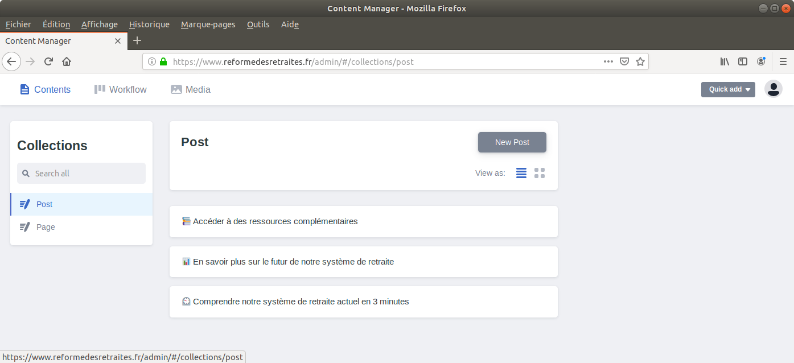
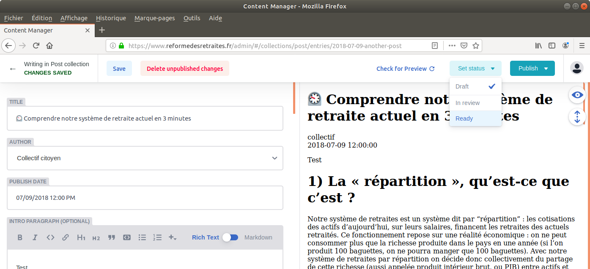
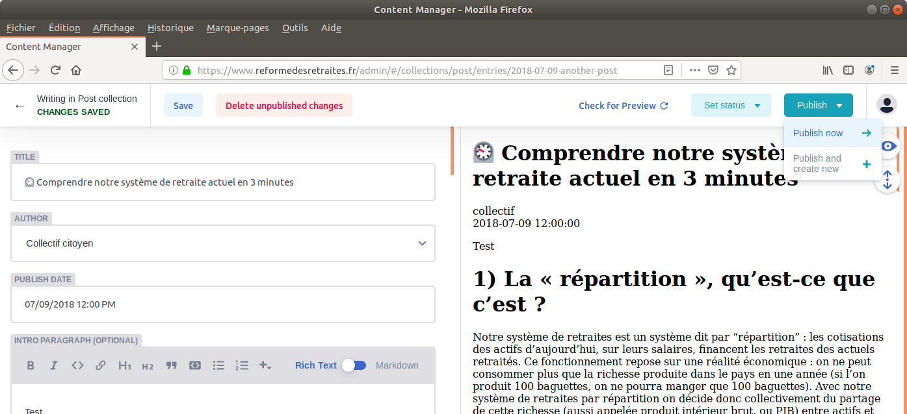

# Site public du collectif reformedesretraites.fr


## Contributions éditoriales

La plupart des textes peut être modifiée à partir de https://www.reformedesretraites.fr/admin.

Les identifiants d'accès peuvent être demandés sur le groupe.

Une fois connecté.e, il faut choisir page à modifier à partir de l'écran suivant.



Une fois les modifications sauvegardées, un brouillon (_draft_) est généré. Pour mettre en ligne les modifications, il faut indiquer que ce brouillon est prêt à être publié. Il faut changer son statut à partir du bouton en haut à droite (_Set status_), comme visible sur l'écran suivant.



Enfin, il faut utiliser le bouton en haut à droite (_Publish_) et cliquer sur _Publish now_ pour mettre en ligne les modifications.



et voilà !


## Contributions structurelles

Certaines modifications ne peuvent pas être faites sur Netlify. Il est nécessaire de récupérer une version du dépôt en local et d'y faire les modifications souhaitées.

```bash
bundle install
bundle exec jekyll server --watch
```

Une version locale du site est alors visible à l'adresse suivante [localhost:4000](http://localhost:4000/).

Pour toutes questions, vous pouvez nous contacter via [le formulaire de contact](https://www.reformedesretraites.fr/contact) ou bien créer une [_issue_](https://github.com/reformedesretraites/site/issues/new).
